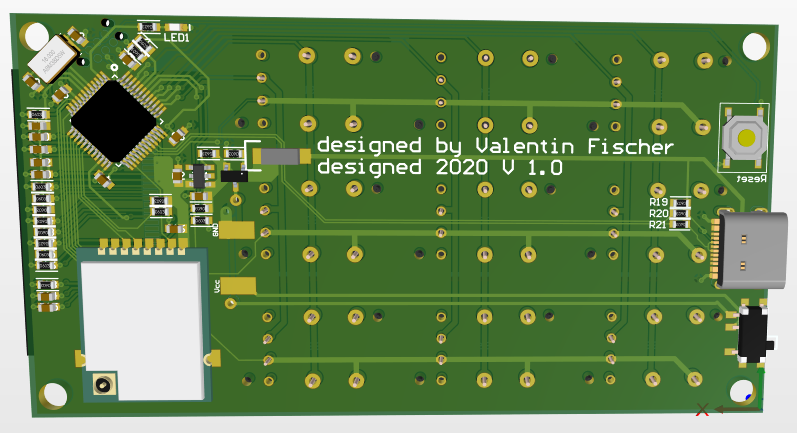

# NRF Remote Control
STM32 and NRF24L01 based remote control which can send and receive UDP packets.

## Software
### UDP Protocol
The remote can send arbitrary UDP packets to any IP/port via the gateway. A more user-friendly way to configure this is in development.

To communicate with the remote you can use the UDP ASCII protocol. You have to send an UDP packet to the gateway on port `1337`. The commands have the format `command;parameter1;parameter2;...`

The following commands are supported:

| Command   | Parameters      | Example             | Description                                 |
|-----------|-----------------|---------------------|---------------------------------------------|
| print     | text            | `print;Hello World` | Print the text "Hello World" to the display |
| setLed    | buttonID, state | `setLed;4;1`        | Turn on LED on button 4                     |
| clearLeds |                 | `clearLeds`         | Turn off all LEDs on the remote             |

## Hardware
### Gateway
The gateway uses the [StEth32 Baseboard](https://github.com/Techbeard/StEth32_Base) and the firmare is also kept in this repository under [Software_Gateway](Software_Gateway).

### Remote Control 
#### PCB Screenshots
 

